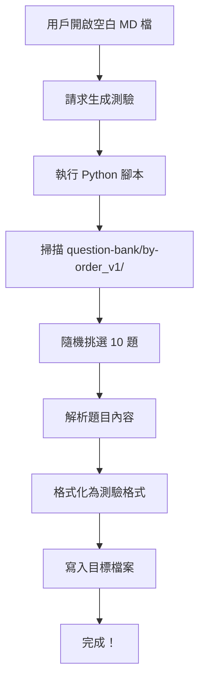

# Test Skills - 模擬測驗生成技能

> 從題庫隨機挑選題目，生成標準格式的模擬測驗

---

## 🎯 技能目的

此技能用於從 `question-bank/by-order_v1/` 題庫中隨機挑選 10 題（或指定數量），生成模擬測驗檔案，確保：
1. **隨機性** - 每次生成不同的題目組合
2. **標準格式** - 考試風格的呈現方式
3. **答案分離** - 答案放在檔案最下方，避免作答時看到

---

## 📥 輸入需求

### 必要資訊
- **目標檔案** - 用戶已開啟的空白 Markdown 檔案（或指定路徑）

### 選填資訊
- **題目數量** - 預設 10 題，可自訂（如 5 題、15 題）
- **隨機種子** - 用於可重現的隨機結果（測試用）

---

## 📤 輸出格式

生成的測驗檔案包含以下結構：

```markdown
# Databricks 模擬測驗

**題數:** 10 題
**時間建議:** 20 分鐘

---

## 第 1 題

[題目內容]

A. [選項 A]
B. [選項 B]
C. [選項 C]
D. [選項 D]

---

## 第 2 題

...

---

## 📝 答案

<details>
<summary>點擊查看答案</summary>

| 題號 | 答案 | 題目 ID |
|------|------|---------|
| 1 | **B** | `Q-023` |
| 2 | **A** | `Q-047` |
...

</details>
```

---

## 🔧 使用方式

### 步驟 1: 準備目標檔案
用戶需要先開啟或指定一個空白 Markdown 檔案（如 `mock-exam-01.md`）

### 步驟 2: 執行 Python 腳本
使用 `scripts/random_questions.py` 生成測驗內容：

```bash
# 基本使用（10 題）
python .github/skills/test-skills/scripts/random_questions.py

# 指定題目數量
python .github/skills/test-skills/scripts/random_questions.py --count 15

# 指定隨機種子（可重現）
python .github/skills/test-skills/scripts/random_questions.py --seed 42
```

### 步驟 3: 寫入目標檔案
將生成的內容寫入用戶指定的檔案

---

## 🐍 Python 腳本功能

### 核心函式

#### `find_question_bank_root()` 
自動尋找專案中的 `question-bank/by-order_v1/` 目錄

#### `get_all_question_files(path)`
取得題庫中所有 `Q-*.md` 檔案

#### `parse_question_file(file_path)`
解析單一題目檔案，提取：
- 題目 ID
- 題目內容（題幹）
- 選項（A-D）
- 正確答案

#### `select_random_questions(path, count, seed)`
隨機挑選指定數量的題目

#### `format_exam_output(questions)`
將題目格式化為測驗 Markdown 格式

---

## 💡 使用範例

### 範例 1: 生成標準 10 題測驗

**用戶請求:**
> "幫我生成一個模擬測驗，隨機 10 題"

**執行步驟:**
1. 確認目標檔案（如用戶已開啟 `mock-exam-01.md`）
2. 執行 Python 腳本生成內容
3. 將內容寫入檔案
4. 確認完成

**輸出示例:**
```markdown
# Databricks 模擬測驗

**題數:** 10 題
**時間建議:** 20 分鐘

---

## 第 1 題

在 Delta Lake 中，以下哪個指令可以永久刪除超過 30 天的舊版本資料？

A. VACUUM table_name RETAIN 30 HOURS
B. VACUUM table_name RETAIN 720 HOURS
C. DELETE FROM table_name WHERE _commit_timestamp < current_date() - 30
D. OPTIMIZE table_name ZORDER BY (date_column)

---

[... 其餘 9 題 ...]

---

## 📝 答案

<details>
<summary>點擊查看答案</summary>

| 題號 | 答案 | 題目 ID |
|------|------|---------|
| 1 | **B** | `Q-023` |
| 2 | **A** | `Q-047` |
| 3 | **C** | `Q-012` |
...

</details>
```

---

### 範例 2: 自訂題目數量

**用戶請求:**
> "幫我生成 5 題快速測驗"

**執行命令:**
```bash
python .github/skills/test-skills/scripts/random_questions.py --count 5
```

**結果:**
生成包含 5 題的測驗，時間建議調整為 10 分鐘

---

### 範例 3: 可重現的測驗（測試用）

**用戶請求:**
> "生成一個測驗，使用隨機種子 42 以便重現"

**執行命令:**
```bash
python .github/skills/test-skills/scripts/random_questions.py --seed 42
```

**用途:**
- 測試腳本功能
- 生成固定題目組合用於示範
- 與他人分享相同的測驗題組

---

## 🔑 核心特色

### 1. 自動解析題目
腳本會自動從題庫的 Markdown 檔案中提取：
- 題幹（主要問題）
- 四個選項（A-D）
- 正確答案

### 2. 防作弊設計
答案放在檔案最下方的可摺疊區塊（`<details>`），作答時不會意外看到

### 3. 題目 ID 追蹤
答案表格包含原始題目 ID（如 `Q-023`），方便事後查詢詳細解析

### 4. 時間建議
根據題目數量自動計算建議作答時間（每題 2 分鐘）

---

## 📋 完整工作流程



---

## ⚙️ Python 腳本參數

### 命令列參數

| 參數 | 說明 | 預設值 | 範例 |
|------|------|--------|------|
| `--count` | 題目數量 | 10 | `--count 15` |
| `--seed` | 隨機種子 | None（真隨機） | `--seed 42` |
| `--output` | 輸出檔案路徑 | 標準輸出 | `--output exam.md` |

### 使用範例

```bash
# 生成 15 題並直接寫入檔案
python scripts/random_questions.py --count 15 --output my-exam.md

# 使用固定種子生成可重現的測驗
python scripts/random_questions.py --seed 123 --output demo-exam.md

# 輸出到標準輸出（配合重定向）
python scripts/random_questions.py > test.md
```

---

## 🎓 適用場景

### 1. 自我測驗
定期生成模擬測驗，評估學習進度

### 2. 考前衝刺
考試前生成多組測驗，密集練習

### 3. 弱點檢測
做完測驗後，根據答案表格的題目 ID，查詢錯誤題目的詳細解析

### 4. 團隊練習
生成相同測驗（使用相同 seed）供團隊成員一起練習

---

## ⚠️ 注意事項

### 題目解析要求
腳本假設題目檔案符合以下格式：
- 包含 `## 題目` 章節
- 選項格式為 `A. ...` 或 `A) ...` 或 `A、...`
- 包含 `## 正確答案` 或 `## 解析` 章節標註答案

### 錯誤處理
如果題目檔案格式不正確，腳本會：
- 顯示警告訊息
- 跳過該題目
- 繼續處理其他題目

### 題庫依賴
腳本依賴 `question-bank/by-order_v1/` 目錄的存在，如果題庫路徑改變，需更新腳本中的路徑設定

---

## 🔍 品質檢查清單

生成測驗後，請確認：
- [ ] 所有題目都有 4 個選項（A-D）
- [ ] 答案表格與題目數量一致
- [ ] 題目 ID 正確對應到題庫檔案
- [ ] 答案隱藏在可摺疊區塊中
- [ ] 時間建議合理（題數 × 2 分鐘）

---

## 🐛 疑難排解

### 問題 1: 找不到題庫目錄
**錯誤訊息:**
```
找不到 question-bank/by-order_v1/ 目錄
```

**解決方案:**
確認腳本執行位置正確，或在專案根目錄執行：
```bash
cd /path/to/DatabricksExamHelper
python .github/skills/test-skills/scripts/random_questions.py
```

---

### 問題 2: 解析題目失敗
**錯誤訊息:**
```
警告: 無法解析題目內容 - Q-XXX.md
```

**解決方案:**
檢查該題目檔案格式是否符合標準模板，特別是：
- `## 題目` 章節是否存在
- 選項格式是否正確
- 答案是否明確標註

---

### 問題 3: 生成題目數少於預期
**現象:**
請求 10 題但只生成 7 題

**原因:**
部分題目檔案解析失敗被跳過

**解決方案:**
檢查腳本輸出的警告訊息，修正對應題目的格式問題

---

## 📚 相關資源

### 專案檔案
- [question-bank/by-order_v1/](../../../question-bank/by-order_v1/) - 題庫目錄
- [question-template.md](../../../question-bank/_template/question-template.md) - 題目標準格式
- [scripts/random_questions.py](./scripts/random_questions.py) - 本技能使用的 Python 腳本

### 相關 SKILL
- [solve-question](../solve-question/SKILL.md) - 題目解析技能（用於查詢錯誤題目的詳細解答）

---

## 🚀 進階使用

### 自訂篩選條件
修改 `random_questions.py` 可實現：
- 按主題篩選題目（如只選「Delta Lake」相關題目）
- 按難度篩選（如只選 L2-Intermediate 題目）
- 排除已做過的題目

### 整合其他工具
- 配合 GitHub Actions 自動生成每週測驗
- 整合到學習管理系統
- 生成 PDF 格式的紙本測驗

---

**透過隨機測驗，將被動學習轉化為主動評估！📝**
