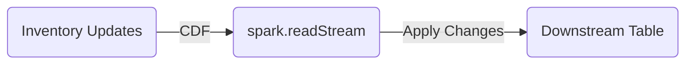

# Question #001

---

## 題目資訊

### 題目編號
**ID:** `Q-001`

### 來源
**來源:** Sample / Community

### 難度等級
**難度:** `L2-Intermediate`

---

## 題目內容

### 題幹

A data engineering team at a supply chain company uses Lakeflow Declarative Pipelines to manage inventory data. The team maintains a streaming table, `inventory_updates`, with Change Data Feed (CDF) enabled. The table captures real-time changes to product inventory levels, with columns: `product_id`, `quantity`, and `update_timestamp`.

The team needs to incrementally propagate **all** inventory changes from the `inventory_updates` table to downstream layers.

Which implementation approach correctly satisfies this requirement?

### 選項

- **A.** Use `spark.readStream` to consume the `inventory_updates` table with `skipChangeCommits`, and propagate the newly added data incrementally to downstream tables.
- **B.** Use `spark.readStream` to consume the `inventory_updates` table directly, and propagate the new updates incrementally to downstream tables.
- **C.** Use `spark.readStream` to consume the `inventory_updates` table's CDF, and apply the changes into downstream tables using AUTO CDC APIs.
- **D.** Use `spark.read` to consume the `inventory_updates` table's CDF, and merge the changes into downstream tables using `MERGE INTO`.

---

## 標籤系統

### Topic Tags (技術主題標籤)
**Topics:** `Streaming`, `Delta-CDC`, `ETL-Patterns`

### Trap Tags (陷阱類型標籤)
**Traps:** `Command-Purpose`, `Concept-Confusion`

### Knowledge Domain (知識領域)
**Domain:** Data Engineering / Development

---

## 答案與來源

### 正確答案
**正解:** `C`

### 答案來源
- **來源標註答案:** C
- **社群共識:** C

---

# 題目解析

---

## 📍 考點識別

**核心技術:** Delta Live Tables (DLT) / Change Data Feed (CDF)  
**關鍵概念:** Incremental Processing of Updates/Deletes, `APPLY CHANGES INTO` (Auto CDC)

**題目關鍵字：**
- **Lakeflow Declarative Pipelines**: 暗示使用 DLT 或類似的聲明式框架。
- **Streaming Table**: 來源是串流表。
- **CDF Enabled**: 來源表啟用了 CDF，這是處理變更的關鍵線索。
- **All inventory changes**: 包含 Inserts, Updates, Deletes。

---

## ✅ 正解說明

### 為什麼 C 是正確答案？

**技術原理：**

1.  **CDF 的必要性**:
    標準的 Structured Streaming (`spark.readStream.table("...")`) 預設假設來源是 Append-Only。如果來源 Delta Table 發生了 `UPDATE` 或 `DELETE` 操作，標準串流會報錯（除非設定 `ignoreChanges` 或 `skipChangeCommits`，但這些都會忽略變更或導致重複處理，不符合精確傳播變更的需求）。
    
    要完整且正確地傳播所有變更（增刪改），必須讀取 **Change Data Feed (CDF)**。

2.  **Auto CDC APIs (DLT)**:
    在 DLT (Lakeflow Pipelines) 中，處理 CDF 的標準模式是使用 `APPLY CHANGES INTO` (Python API 為 `dlt.apply_changes`)。這被稱為 "Auto CDC"。
    
    它會自動處理：
    - 亂序資料 (Out-of-order data)
    - 去重 (Deduplication)
    - 根據 CDF 的操作類型 (Insert/Update/Delete) 更新目標表（Type 1 或 Type 2 SCD）。

**程式碼概念：**

```python
# 讀取 CDF
changes_df = (spark.readStream
    .option("readChangeFeed", "true")  # ✅ 關鍵選項
    .table("inventory_updates"))

# 使用 DLT Auto CDC 應用變更 (概念碼)
dlt.apply_changes(
    target = "downstream_target",
    source = changes_df,
    keys = ["product_id"],
    sequence_by = col("update_timestamp"),
    apply_as_deletes = expr("op = 'DELETE'"),
    ...
)
```

**C 選項完全符合這個模式：**
- `spark.readStream` w/ CDF: 正確獲取變更流。
- `AUTO CDC APIs`: 正確應用變更到下游。

---

## ❌ 錯誤選項排除

### A - `skipChangeCommits`

**為什麼錯誤？**

- **資料遺失**: `skipChangeCommits` 選項會告訴 Spark Streaming **忽略** 那些會破壞 Append-only 假設的提交（如 Updates/Deletes）。
- **後果**: 下游表會遺漏所有的庫存更新與刪除操作，導致數據不一致。

### B - Consume table directly

**為什麼錯誤？**

- **執行失敗**: 預設情況下，如果在 Streaming Source 上執行了 Update/Delete，Spark Streaming 會拋出 `Detected a data update in the source table. This is currently not supported.` 錯誤並停止。
- **即使能跑**: 如果使用了 `ignoreChanges`，它會重新處理被修改檔案中的所有資料（不僅是變更的部分），這會導致下游出現重複資料，且無法區分 Insert 和 Update。它不是 "incrementally propagate updates" 的正確方式。

### D - `spark.read` with `MERGE INTO`

**為什麼錯誤？**

- **Batch 處理**: `spark.read` 是 Batch read，不是 Streaming。這意味著每次執行都會讀取整個 CDF 歷史（或是需要手動管理 Offset 進行微批次讀取），不是 DLT 定義的 "Streaming" 處理方式。
- **不符合 Lakeflow/DLT 最佳實務**: 雖然手動編寫 `MERGE INTO` 是可能的（在 `foreachBatch` 中），但在 Lakeflow Declarative Pipelines 中，`APPLY CHANGES INTO` (Auto CDC) 是官方封裝好、更高效且聲明式的做法。選項 C 比 D 更準確描述了 DLT 的標準模式。

---

## 🧠 記憶法

### 口訣

**「CDF 抓變更，Auto CDC 來更新」**

- **CDF (Change Data Feed)**: 負責捕捉 Insert/Update/Delete。
- **Auto CDC (APPLY CHANGES)**: 負責把這些變更 Merge 進目標表。

### DLT 處理變更流程



---

## 📚 官方文件

- [Change Data Feed (CDF)](https://docs.databricks.com/delta/delta-change-data-feed.html)
- [Delta Live Tables - CDC](https://docs.databricks.com/delta-live-tables/cdc.html#process-change-data)

---

**[返回題目](#question-001)**
